 

 

## Tech Stack

  

 

 

## Featured Projects

| Project | What it does | Stack |
| :-- | :-- | :-- |
| **[MealPass](https://github.com/jaga42-ui/event-meal-management-system)** | Full-stack event logistics app that replaces paper meal coupons with tracked digital passes | HTML · JavaScript · PHP |
| **[climatic-ui](https://github.com/jaga42-ui/climatic-ui)** | Responsive weather interface built in vanilla JavaScript — no framework, no build step | JavaScript · CSS |
| **[Sahayam](https://github.com/jaga42-ui/Sahayam)** | _Add one line here on the problem it solves_ | JavaScript |

 

  

 

## Currently

- 🎓 MCA student at Fakir Mohan University
- 🧩 Working through data structures and algorithms
- 🛠️ Building [getfreetoolsai.com](https://getfreetoolsai.com)

 

  
  
  
  

  <i>“Code. Build. Learn. Repeat.”</i>

